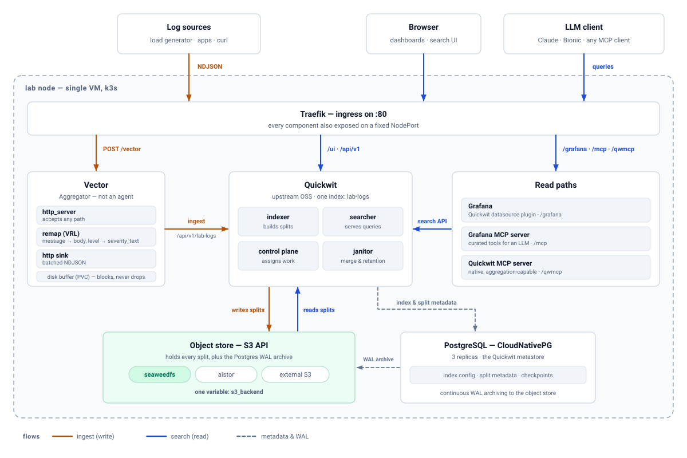

# Quickwit Logs Lab — Ansible

[](https://github.com/juanbrny/quickwit-logs-lab-automaton/actions/workflows/ci.yml)

One Ansible playbook turns a single VM into a complete, working **upstream
Quickwit** log platform — Kubernetes, object storage, metastore, ingestion,
search engine, dashboards and LLM access — and then proves it works by pushing
a log through the whole pipeline and reading it back.

One command, about twenty minutes, no prior Quickwit knowledge required.

> **Lab only.** Single node, local storage, no TLS by default — a reproducible
> test and demo environment, not a production posture.

## What it builds

<picture>
  <source media="(prefers-color-scheme: dark)" srcset="docs/images/architecture-dark.svg">
  
</picture>

Everything in that picture is deployed by `ansible-playbook site.yml`. The two
blue read paths and the amber write path are the flows the `verify` role
exercises on every run.

**New to Quickwit, Vector or MCP?** Read
**[docs/concepts.md](docs/concepts.md)** first — a ten-minute primer on what
each piece does and why it is there. It assumes no prior knowledge of any of
them.

## Why you might want it

- **A whole log platform on one VM.** Every layer, from the Kubernetes distro
  up to a verified log push, in a single run.
- **Swap the object store with one variable.** `s3_backend` selects
  `seaweedfs` (default, in-cluster), `aistor` (MinIO AIStor operator), or
  `external` — point it at MinIO, StorageGRID, Ceph RGW or real AWS S3 and test
  Quickwit against storage you already own.
- **Query the logs four ways.** Grafana with the Quickwit datasource plugin,
  Quickwit's own search UI, the raw API, or an LLM through either MCP server.
- **Run it against a node anywhere.** By default all Kubernetes work executes
  *on the node* over SSH — your laptop only needs **port 22**, never the API
  server. SSM (no inbound ports at all) and LAN models also ship.
- **Rebuild the identical lab every time.** Every chart, image and tool version
  is pinned in one file; upgrades are deliberate, one line at a time.
- **Re-run any part safely.** Everything is idempotent, with tags for partial
  runs.

## Before you start

| | |
|---|---|
| **The node** | ~8 vCPU / 32 GB RAM / 100 GB disk. Preflight checks this before installing anything. |
| **OS** | Tested on SLES / openSUSE Leap 16.0. RHEL / Rocky 10 planned. |
| **Access** | SSH to the node as a sudo-capable user, and outbound HTTPS *from the node* (it pulls the charts and images itself). |
| **Your laptop** | `ansible-core` >= 2.15 and `pip install kubernetes`. **No helm or kubectl needed** — they are installed on the node. |

Which inventory template to start from:

| You have | Use | Ports needed |
|---|---|---|
| A VM with a public IP (cloud, hosted) | `hosts.yml.example` — on-node over SSH | 22 in, 443 out |
| An AWS instance with SSH disabled by policy | `hosts-ssm.yml.example` — on-node over SSM | none in, 443 out |
| A VM on your LAN or VPN | `hosts-lan.yml.example` — workstation drives it | :6443 reachable |

## Quick start

```bash
git clone https://github.com/juanbrny/quickwit-logs-lab-automaton.git
cd quickwit-logs-lab-automaton
ansible-galaxy collection install -r requirements.yml

# 1. Inventory — your node's address and SSH user
cp inventory/hosts.yml.example inventory/hosts.yml
$EDITOR inventory/hosts.yml

# 2. Secrets — replace every CHANGE_ME, then encrypt
cp group_vars/all/secrets.yml.example group_vars/all/secrets.yml
$EDITOR group_vars/all/secrets.yml
ansible-vault encrypt group_vars/all/secrets.yml

# 3. Deploy everything
ansible-playbook site.yml --ask-vault-pass
```

The default (`seaweedfs`) backend needs no external accounts. Invent the S3 app
key pair, pick a Grafana password, and generate an MCP caller token with
`openssl rand -hex 32`. The `aistor` backend additionally needs a free
single-node eval licence and a genuinely strong tenant root password — recent
charts reject weak defaults such as `minio123`.

The run ends with a `verify` block that pushes a log through Vector into
Quickwit and reads it back. If it prints `All good`, the lab is live.

## Your first five minutes

With `<node>` as your node's address:

| What | URL |
|---|---|
| Quickwit search UI | `http://<node>/ui` |
| Quickwit API | `http://<node>/api/v1/...` |
| **Vector ingest** | `http://<node>/vector` · NodePort `:30900` |
| Grafana | `http://<node>/grafana` · NodePort `:30300/grafana` |
| Grafana MCP server | `http://<node>/mcp` · NodePort `:30800/mcp` |
| Quickwit MCP server | `http://<node>/qwmcp` · NodePort `:30801/mcp` |

**1. Send a log the way everything else does.**

```bash
curl -X POST http://<node>/vector \
  -H 'Content-Type: application/x-ndjson' \
  -d '{"message":"hello from curl","level":"warn","service":"demo"}'
```

**2. Read it back a few seconds later.**

```bash
curl "http://<node>/api/v1/lab-logs/search?query=service_name:demo"
```

Notice what changed: you sent `message`, `level` and `service`, but you search
for `service_name`. Vector rewrote the field names in flight onto the index's
`body` / `severity_text` / `service_name` schema. That is the whole point of
having Vector in the path — senders keep their own format, and the mapping
lives in exactly one place.

**3. Open Grafana** at `http://<node>/grafana`, log in with the password from
your secrets file, and pick the pre-provisioned **Quickwit** datasource. It is
already pointed at the `lab-logs` index and verified during the run.

**4. Point an LLM at it.** Both MCP servers speak streamable HTTP. Give your
client `http://<node>/mcp` with the bearer token from your secrets file, or
`http://<node>/qwmcp` for the native server, which can do aggregations rather
than just returning documents. See
[MCP servers](README-detailed.md#mcp-servers--llm-access-to-the-logs).

## Choosing where the logs are stored

One variable in `group_vars/all/main.yml`:

```yaml
s3_backend: seaweedfs     # or: aistor | external
```

| Backend | What it is | Use it when |
|---|---|---|
| `seaweedfs` | Lightweight S3-compatible store, in-cluster. **Default.** | You just want a working lab with no external dependencies. |
| `aistor` | MinIO AIStor operator + tenant, in-cluster. | You want to exercise the MinIO operator path. Needs a free eval licence. |
| `external` | Any S3 store you already run. | You want to test Quickwit against *your* storage — MinIO, StorageGRID, Ceph RGW, AWS S3. |

Each backend publishes the same small contract (endpoint, scheme, port,
namespace, credentials) that the rest of the roles consume, so nothing outside
the backend role knows which one is active. Details and how to add a fourth in
[Storage backends](README-detailed.md#storage-backends).

## Running parts of it

The playbook is tagged, so you rarely need a full run:

```bash
ansible-playbook site.yml -t preflight              # size-check a VM, install nothing
ansible-playbook site.yml -t storage,tooling        # (re)deploy just the S3 backend
ansible-playbook site.yml -t quickwit,vector,verify # redeploy the log path + smoke test
ansible-playbook site.yml -t verify                 # re-run the end-to-end checks alone
```

| Tag | Covers |
|---|---|
| `preflight` | VM sizing checks |
| `distro` | k3s |
| `tooling` | helm, kubectl and the Python client, on the node |
| `storage` | the active S3 backend |
| `database` | CloudNativePG + the Quickwit metastore cluster |
| `quickwit` | Quickwit + its ingress |
| `vector` | Vector + its ingress |
| `grafana` | Grafana + the Quickwit datasource plugin |
| `mcp` | both MCP servers |
| `verify` | the end-to-end checks |

Useful on the node itself:

```bash
sudo kubectl get pods -A     # what is running
sudo helm list -A            # what is deployed, at which versions
```

## When something goes wrong

**[docs/troubleshooting.md](docs/troubleshooting.md)** collects the failures
that actually happen, with the command that diagnoses each one — clock skew,
ingress route collisions, `helm` losing its kubeconfig, a chart falling back to
the wrong version, leftover helper pods, and the rest.

## Documentation map

| Document | Read it when |
|---|---|
| **This README** | Getting the lab running for the first time. |
| [docs/concepts.md](docs/concepts.md) | You are new to Quickwit, Vector or MCP and want to know what the pieces do. |
| [README-detailed.md](README-detailed.md) | You need the reference — execution models, the storage contract, version pinning, the index doc mapping, the credential flow, CI. |
| [docs/troubleshooting.md](docs/troubleshooting.md) | Something failed and you want the diagnosis. |
